# 💼 CareerHub - Job Application & Internship Management System

A full-stack MERN web application that enables applicants to discover jobs and internships, apply online, and track their application status while providing administrators with a powerful dashboard to manage job postings and applications.

## 🚀 Live Demo

**Frontend:** https://job-application-internship-manageme.vercel.app/

**Backend API:** https://jobapplication-internship-management.onrender.com

---

## ✨ Features

### 👨‍🎓 Applicant

* User Registration & Login
* Secure JWT Authentication
* Browse Jobs & Internships
* View Job Details
* Apply for Jobs
* Track Application Status
* User Dashboard
* Responsive UI

### 👨‍💼 Admin

* Admin Authentication
* Create Job Listings
* Update Job Listings
* Delete Job Listings
* View All Applications
* Update Application Status
* Admin Dashboard

### 🔒 Security

* JWT Authentication
* Password Hashing using bcrypt
* Role-Based Authorization
* Protected Routes
* Email Validation
* Strong Password Validation

---

## 🛠 Tech Stack

### Frontend

* React.js
* React Router DOM
* Axios
* Context API
* CSS3
* React Icons

### Backend

* Node.js
* Express.js
* JWT
* bcryptjs

### Database

* MongoDB Atlas
* Mongoose

### Deployment

* Vercel
* Render

---

## 📁 Project Structure

```text
JobApplication-Internship-Management/
│
├── backend/
│   ├── config/
│   ├── controllers/
│   ├── middleware/
│   ├── models/
│   ├── routes/
│   ├── package.json
│   └── server.js
│
├── frontend/
│   ├── src/
│   │   ├── components/
│   │   ├── context/
│   │   ├── pages/
│   │   ├── services/
│   │   ├── App.jsx
│   │   └── main.jsx
│   └── package.json
│
└── README.md
```

---

## 📌 API Endpoints

### Authentication

| Method | Endpoint           |
| ------ | ------------------ |
| POST   | `/api/auth/signup` |
| POST   | `/api/auth/login`  |

### Jobs

| Method | Endpoint        |
| ------ | --------------- |
| GET    | `/api/jobs`     |
| POST   | `/api/jobs`     |
| PUT    | `/api/jobs/:id` |
| DELETE | `/api/jobs/:id` |

### Applications

| Method | Endpoint                       |
| ------ | ------------------------------ |
| POST   | `/api/applications`            |
| GET    | `/api/applications/me`         |
| GET    | `/api/applications`            |
| PUT    | `/api/applications/:id/status` |

---

## ⚙️ Installation

### Clone Repository

```bash
git clone https://github.com/Juhi-Dubey/JobApplication-Internship-Management.git

cd JobApplication-Internship-Management
```

### Backend

```bash
cd backend

npm install

npm run dev
```

### Frontend

```bash
cd frontend

npm install

npm run dev
```

---

## 🔑 Environment Variables

Create a `.env` file inside the **backend** folder.

```env
PORT=5000

MONGO_URI=YOUR_MONGODB_URI

JWT_SECRET=YOUR_SECRET_KEY
```

---

## 📸 Screenshots

### 🏠 Landing Page

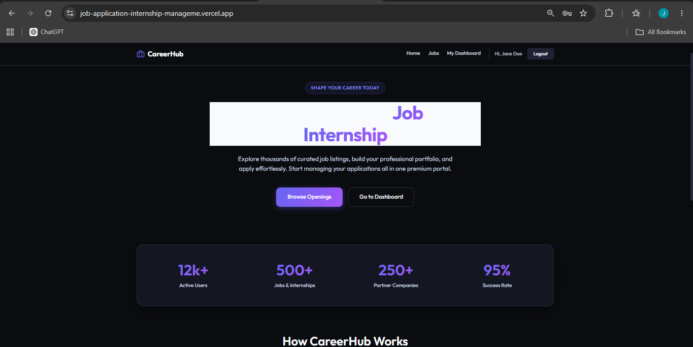

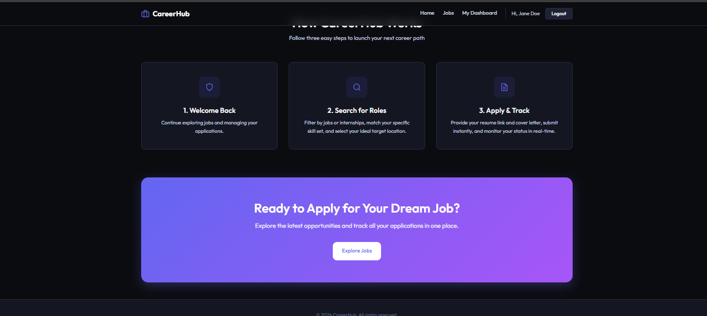

### 🔐 Login Page

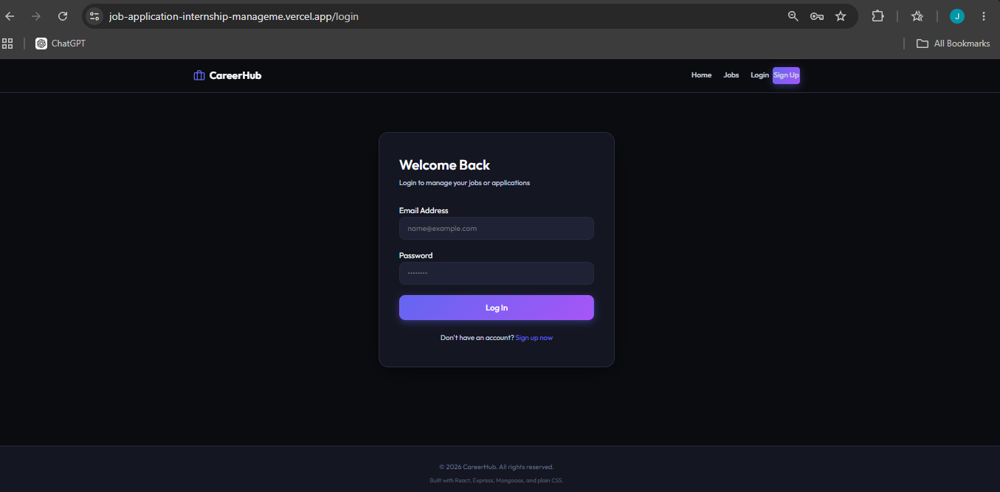

### 📝 Signup Page

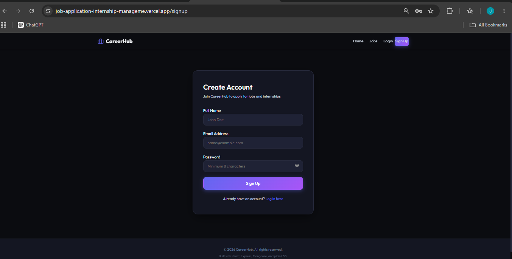

### 💼 Jobs Page

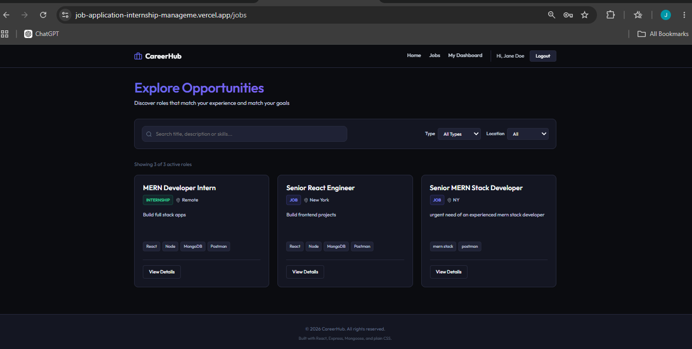

### 📄 Job Details

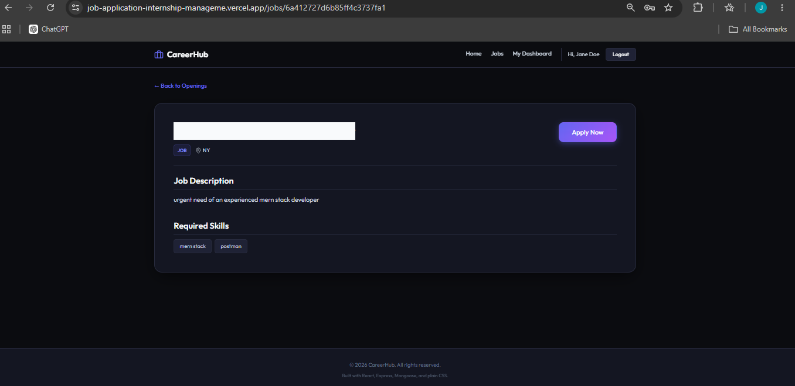

### 📋 Post Job / Internship

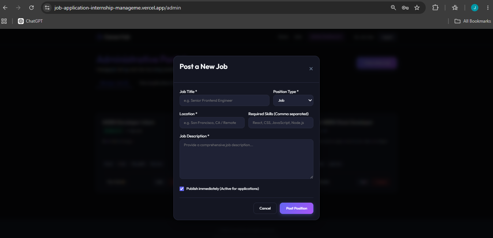

### 👤 User Dashboard

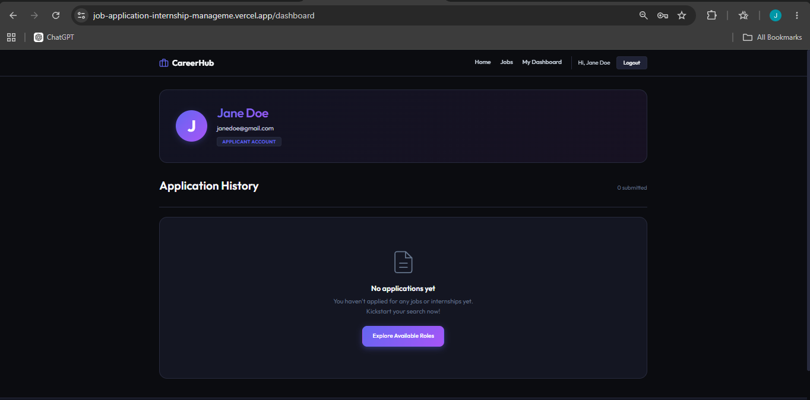

### 👤 User Dashboard (Applications)

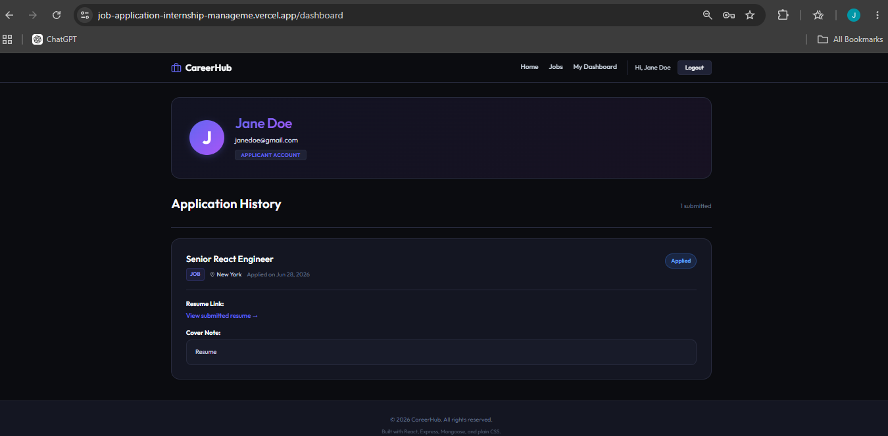

### 🛠️ Admin Dashboard

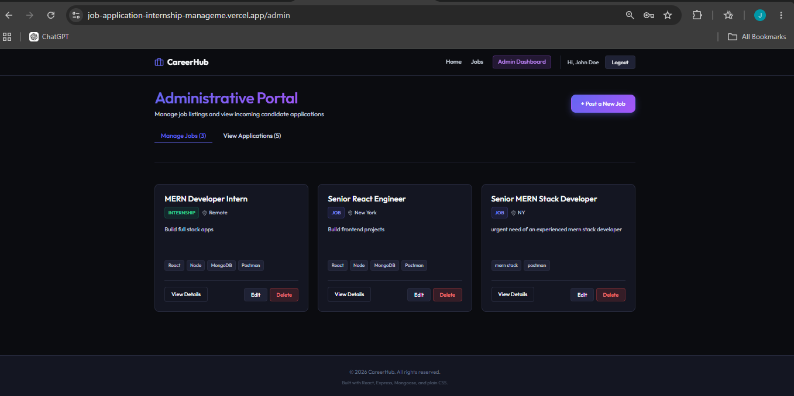

### Application Management

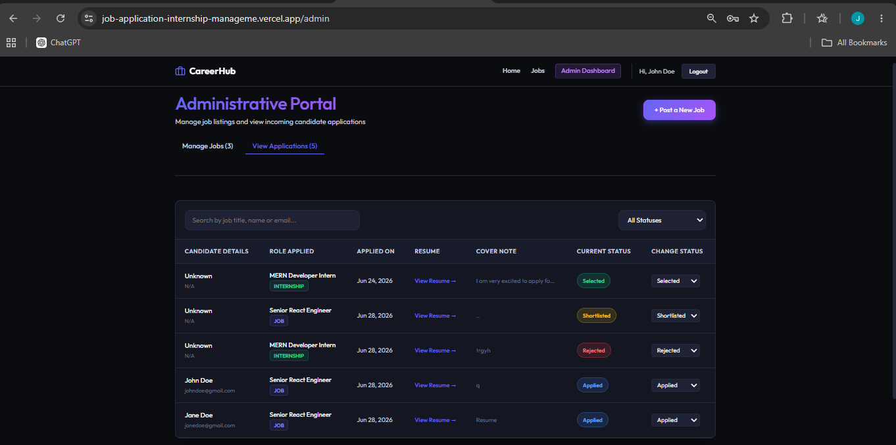


---


## 📚 Learning Outcomes

Through this project, I gained practical experience in full-stack web development using the MERN stack. Some of the key concepts I learned include:

* Building RESTful APIs using Node.js and Express.js.
* Designing and managing MongoDB databases with Mongoose.
* Implementing JWT-based authentication and role-based authorization.
* Securing user passwords using bcrypt hashing.
* Creating reusable React components and managing application state with Context API.
* Implementing protected routes for authenticated users.
* Performing CRUD operations for jobs and applications.
* Integrating frontend and backend using Axios.
* Handling form validation, error handling, and user-friendly feedback.
* Deploying a full-stack application using Vercel and Render.
* Using Git and GitHub for version control and project management.
* Structuring a scalable MERN application using a modular architecture.

This project strengthened my understanding of building secure, responsive, and production-ready web applications while following best practices in full-stack development.

---

## 👩‍💻 Developer

**Juhi Dubey**

* BCA Student
* MERN Stack Developer
* GitHub: https://github.com/Juhi-Dubey

---

## 📄 License

This project is developed for educational and internship purposes.
